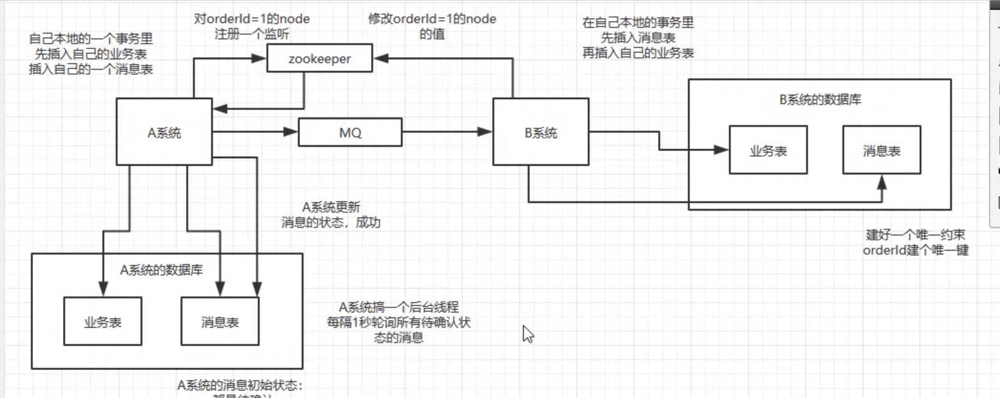
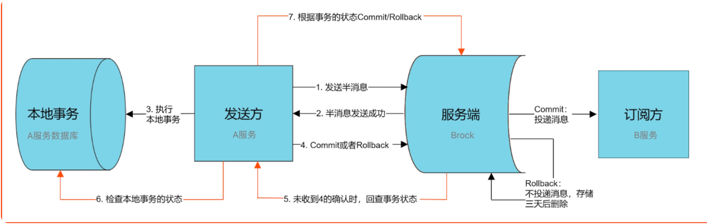

分布式事务

**XA：**

一个服务调用多个库，全部成功或者失败。使用两阶段提交协议，阻塞。

但是微服务不允许一个服务操作多个库，最多远程调用别的服务接口，去操作别的数据库。

所以使用

**TCC：**

TCC预留资源然后确认，再回滚，需要自己写预留和回滚的代码，严重耦合，不同的业务需要使用不同的tcc。只适合和资金相关绝对不能错可以使用这个。

**本地消息表方案：**

A服务一个业务表和消息表，B服务也一个业务表和消息表

A监听zk，来判断消息是否消费，然后更新A消息的状态为成功

大量依赖于mysql的消息表，高并发性能不行

**可靠消息的最终一致性**

基于rocketMQ

好处：自动的轮询机制，判断业务操作是否情况